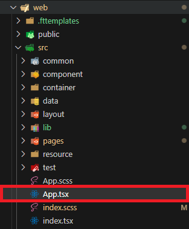
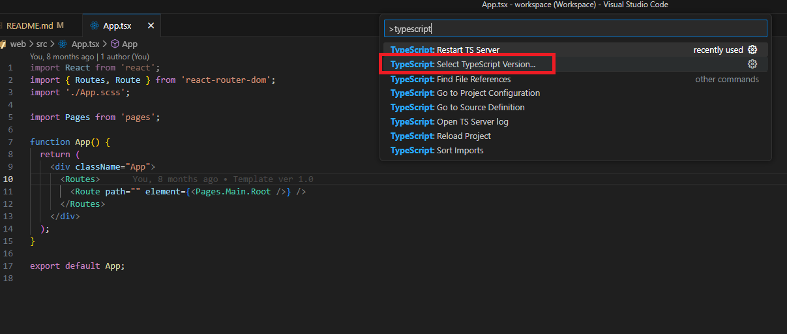
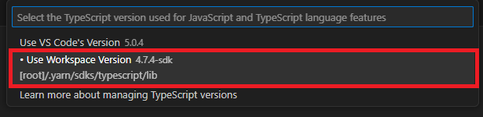
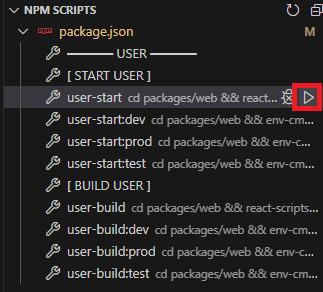

### **프로젝트 초기 설정**

1. 기본 설정파일 생성

   ```bash
   yarn install
   ```

1. Workspace 버젼 Typescript 사용

   - 아무거나 tsx 파일 열기

     

   - 단축키 `ctrl(command) + shift + p`사용, `typescript` 검색

     

   - `use Workspace Version` 선택

     

1. NPM SCRIPT 서버 실행

   
